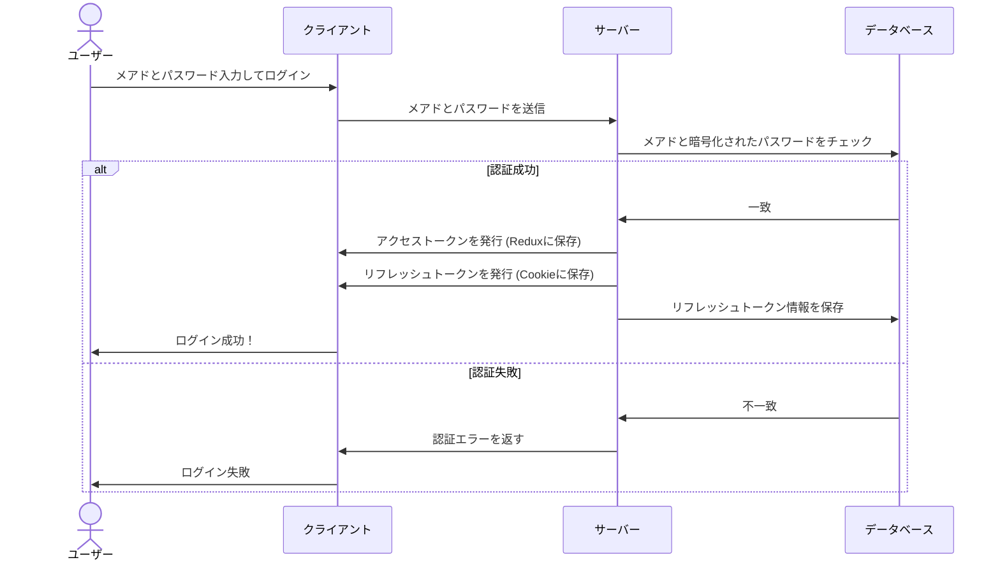

```mermaid
sequenceDiagram
    actor user as ユーザー
    participant client as クライアント
    participant server as サーバー
    participant DB as データベース

    user ->> client: メアドとパスワード入力してログイン
    client ->> server: メアドとパスワードを送信
    server ->> DB: メアドと暗号化されたパスワードをチェック

    alt 認証成功
        DB ->> server: 一致
        server ->> client: アクセストークンを発行 (Reduxに保存)
        server ->> client: リフレッシュトークンを発行 (Cookieに保存)
        server ->> DB: リフレッシュトークン情報を保存
        client ->> user: ログイン成功！
    else 認証失敗
        DB ->> server: 不一致
        server ->> client: 認証エラーを返す
        client ->> user: ログイン失敗
    end

```
